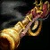

# Circleplosion

This was a joke project that I made between *(and sometimes during)* lessons at college (around 2013 judging by the jQuery license) because I wanted to play games at college but the IT staff had a habit of blocking websites, Chrome extensions, etc. This was made before I had a real grasp of canvas and so the entire game is made using DOM elements and jquery animations… because those are definitely optimised haha. Apparently something has changed between then and now which is why the players seems to have a square in them but I do intend to redo this at some point with more modern practices, as I seem to use prototype as nothing more than some kind of namespace rather than as inheritance… weird. But it is interesting to see how my coding style has changed in less than half a decade.

## Controls

Action | Key(s)
----|----
Player 1 Movement | W A S D
Player 1 Shoot | Space
Player 2 Movement | UP DOWN LEFT RIGHT (ARROWS)
Player 2 Shoot | Enter

## Buffs and Debuffs

Icon | Target | Description
----|----|----
 | Self | Doubles your speed for 4 seconds.
 | Self | Deal +10 extra bullet damage for 4 seconds.
 | Self | Rengerates +12 additional health per second for 7 seconds.
 | Enemy | Halves the speed of enemy for 2 seconds.
 | Enemy | Your enemies deal -7 less bullet damage for 10 seconds.
 | Enemy | Your enemies do not regenerate any health for 4 seconds.

## Git History

Sadly the git history, if this ever had one, is lost to time.